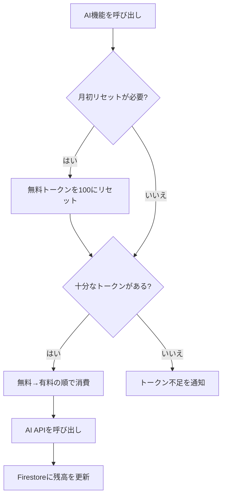

# トークン制仕様書

## 概要
AI機能の利用を制御するため、トークンベースの消費制限を導入する。
トークンは「**無料トークン**」と「**有料トークン**」に分けて管理し、無料トークンが優先消費される。

---

## 1. トークンの種類

| 項目 | 無料トークン | 有料トークン |
|---|---|---|
| 付与方法 | 毎月自動回復 | 課金（後日実装） |
| 月間付与量 | 100 トークン（暫定） | 購入量に応じる |
| 繰越 | 不可（月初にリセット） | 無期限 |
| 消費優先度 | **先に消費** | 無料トークン消費後 |

---

## 2. トークン消費ルール

各AI機能の呼び出し1回あたりの消費量:

| 機能 | 関数名 | 消費量 | 備考 |
|---|---|---|---|
| AIチャット応答 | `getChatResponse` | 3 | 会話のたびにAI生成 |
| 文法チェック | `getGrammarCorrection` | 1 | 軽量な判定のみ |
| 単語翻訳 | `getWordTranslation` | 1 | 短い出力 |
| デイリー質問生成 | `getDailyQuestion` | 2 | セッションの始めに1回 |
| 画像解析 | `getImageChatResponse` | 5 | マルチモーダルで重い |
| 翻訳＋解説 | `getTranslation` | 3 | 翻訳＋単語解説付き |

> [!NOTE]
> 消費量の数値は暫定値。運用データを見て調整する前提。

---

## 3. 無料トークンの自動回復

- **回復タイミング**: 毎月1日の0:00 UTC
- **回復量**: 上限値（100）まで完全リセット
- **判定方法**: `lastResetDate` をチェックし、現在の月と異なる場合にリセット実行
- **繰越不可**: 残っていた無料トークンは破棄される

---

## 4. トークン消費の優先順位

```
1. 無料トークン残高を確認
2. 足りれば無料トークンから差し引き
3. 無料トークンが不足 → 有料トークンから差し引き
4. 両方とも不足 → AI機能の利用を拒否し、UIで通知
```

---

## 5. データモデル (Firestore)

### コレクション: `users/{userId}`

```typescript
interface UserTokens {
  freeTokens: number;        // 現在の無料トークン残高
  paidTokens: number;        // 現在の有料トークン残高
  lastResetDate: string;     // 最後に無料トークンがリセットされた年月 (例: "2026-02")
  totalUsed: number;         // 累計消費トークン数（統計用）
}
```

> [!IMPORTANT]
> トークン情報は `users/{userId}` ドキュメント内にフィールドとして保持する。
> 新規コレクションは作らず、既存構造に追加する形式を想定。

---

## 6. クライアント側の処理フロー



---

## 7. UI設計（概要）

- **ヘッダーまたはホーム画面**: トークン残高を常時表示
  - 例: `🪙 87 / 100 (+12有料)`
- **利用前確認ポップアップ**: AI機能を呼び出す前に、消費トークン数を表示して確認を求める
  - 例: 「この操作で3トークンを消費します。(残り: 87) 実行しますか？」
  - 「今後表示しない」オプション付き（localStorageで記憶）
- **トークン不足時**: モーダル表示「トークンが不足しています。月初に回復されます。」→ AI機能を**完全ブロック**
- **未ログイン時**: AI機能へのアクセスをブロックし、ログインを促す
- **設定画面**: トークン消費履歴を表示（将来実装）

---

## 8. セキュリティルール

```
// Firestoreセキュリティルールの概要
// ユーザー自身のトークン情報のみ読み取り可能
// トークンの直接書き換えは不可（将来はCloud Functions経由に移行）
```

> [!WARNING]
> 現段階ではクライアント側でトークンを減算するが、
> これは不正操作のリスクがある。課金機能追加時には
> **Cloud Functions経由でのサーバーサイド管理**への移行が必須。

---

## 9. 確定事項

1. ✅ **無料トークンの月間付与量**: 100トークン
2. ✅ **消費量**: 上記テーブルの通り
3. ✅ **未ログインユーザー**: AI機能の利用には**ログイン必須**
4. ✅ **トークン不足時**: AI機能を**完全ブロック**
5. ✅ **利用前確認**: トークンを消費する前に**確認ポップアップを表示**

## 10. 今後の検討事項

1. **サーバーサイド移行**: 課金機能追加時にCloud Functions経由でのトークン管理に移行
2. **課金体系**: 有料トークンの価格設定とパッケージ
